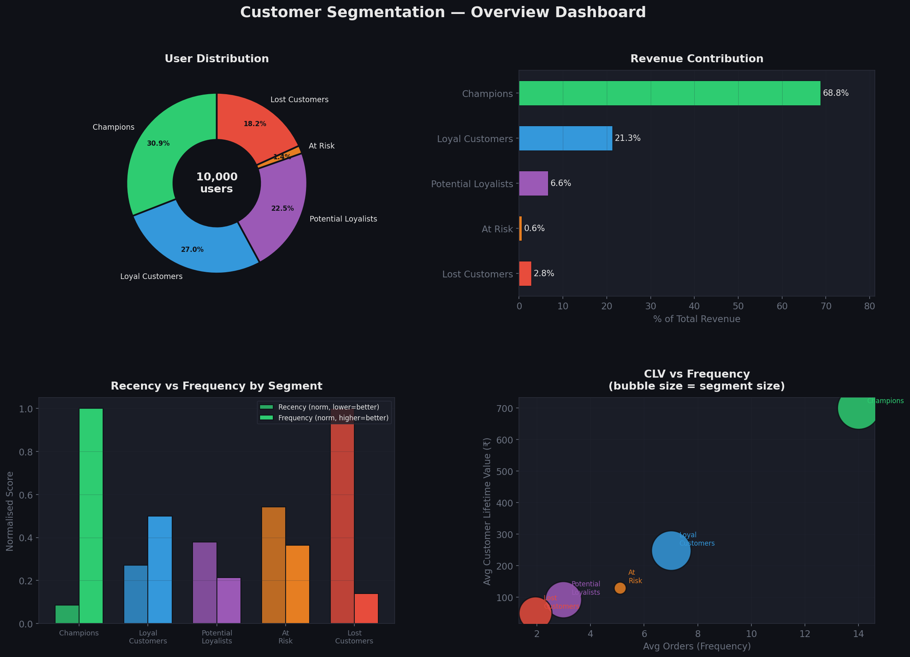
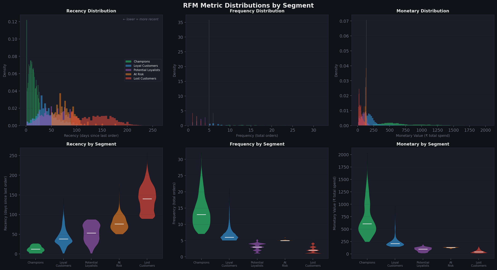
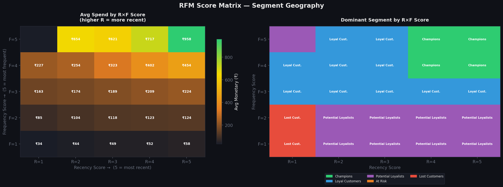
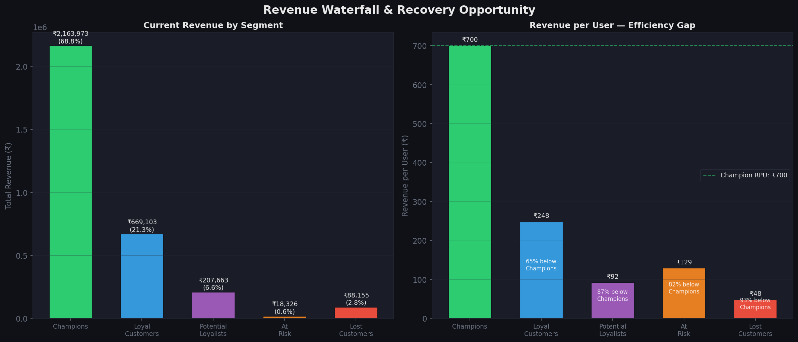
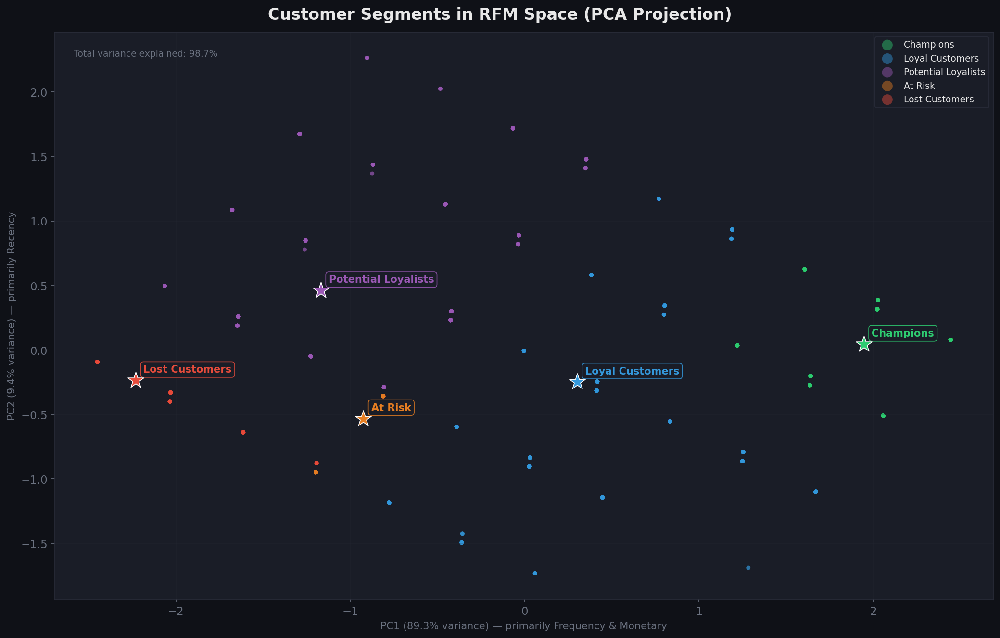
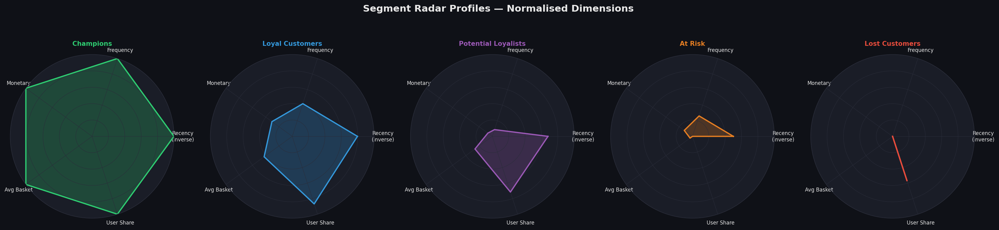
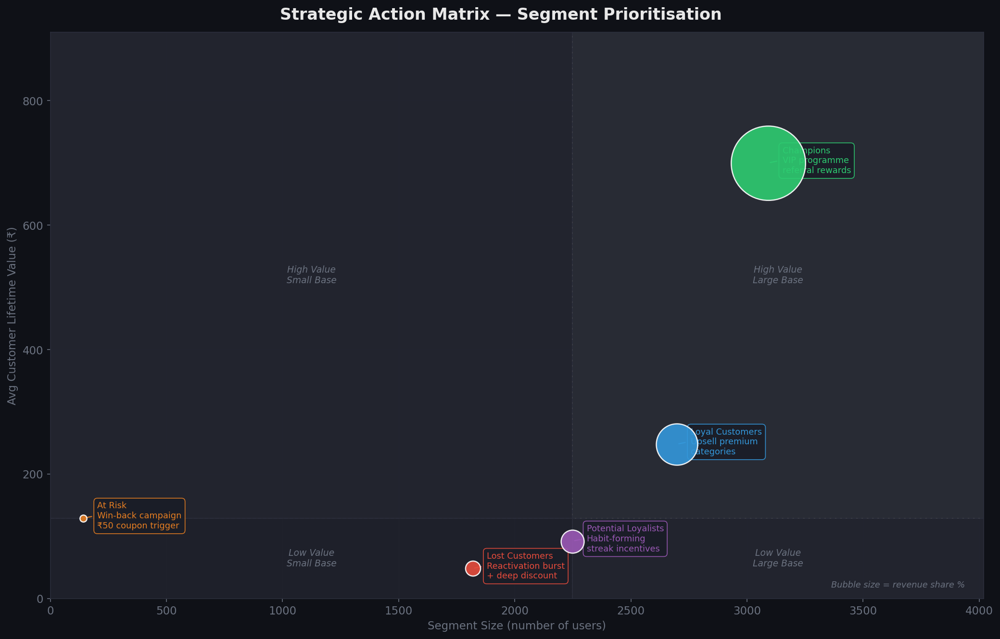

# 🚀 Growth Intelligence Engine
### RFM-Based Customer Analytics for Quick Commerce
**Built for IITM Internship Season · Instacart Market Basket Dataset · Blinkit Analytics Frame**

---

<div align="center">


</div>

---

## 📌 Project Overview

A **production-quality customer analytics pipeline** that identifies high-value customers, at-risk churners, and growth segments using **RFM (Recency · Frequency · Monetary)** analysis — framed through the lens of a **Senior Product Analytics Manager at Blinkit**.

Built on the [Instacart Market Basket Analysis dataset](https://www.kaggle.com/competitions/instacart-market-basket-analysis) (3.4M orders · 206k users).

### Business Questions Answered
- Who are our most valuable customers — and how do we protect them?
- Which customers are silently drifting toward churn?
- Where is the highest-ROI GMV growth opportunity?
- What specific CRM actions should each segment trigger?

---

## 📊 Key Results

| Segment | Users | Revenue Share | Avg CLV | Median Recency | Avg Orders |
|---|---|---|---|---|---|
| 🟢 **Champions** | 3,092 (30.9%) | **68.8%** | ₹700 | 12 days | 14.0 |
| 🔵 **Loyal Customers** | 2,698 (27.0%) | 21.3% | ₹248 | 38 days | 7.0 |
| 🟣 **Potential Loyalists** | 2,249 (22.5%) | 6.6% | ₹92 | 53 days | 3.0 |
| 🔴 **At Risk** | 142 (1.4%) | 0.6% | ₹129 | 76 days | 5.1 |
| ⬛ **Lost Customers** | 1,819 (18.2%) | 2.8% | ₹48 | 140 days | 1.9 |

> **Key Insight:** Champions + Loyal = **58% of users → 90% of revenue**. The single highest-ROI lever: convert 20% of Potential Loyalists to Loyal within 60 days.

---

## 🗂️ Repository Structure

```
growth-intelligence-engine/
│
├── 📄 README.md
├── 📄 requirements.txt
│
├── 📁 src/
│   └── rfm_analysis.py              # Full pipeline (~1000 lines, production-quality)
│
├── 📁 notebooks/
│   └── rfm_walkthrough.ipynb        # Step-by-step narrative notebook
│
├── 📁 visualizations/               # All 7 output charts
│   ├── rfm_01_segment_overview.png
│   ├── rfm_02_distributions.png
│   ├── rfm_03_score_heatmap.png
│   ├── rfm_04_revenue_waterfall.png
│   ├── rfm_05_pca_scatter.png
│   ├── rfm_06_radar_profiles.png
│   └── rfm_07_action_matrix.png
│
└── 📁 data/
    ├── raw/                         # Place Instacart CSVs here
    └── processed/
        ├── rfm_customer_segments.csv
        └── rfm_segment_metrics.csv
```

---

## 🏗️ Pipeline Architecture

```
Raw Data (Instacart orders + products)
         │
         ▼
┌─────────────────────────┐
│  Feature Engineering    │  Recency · Frequency · Monetary
│                         │  Avg basket · Order cadence
└────────────┬────────────┘
             │
             ▼
┌─────────────────────────┐
│  RFM Scoring            │  Quintile binning (1–5 per dimension)
│  (Quantile-based)       │  Recency INVERTED: recent = score 5
└────────────┬────────────┘
             │
             ▼
┌─────────────────────────┐
│  Segmentation Engine    │  Priority-ordered rule matching
│                         │  + PCA 2D validation
└────────────┬────────────┘
             │
             ▼
┌─────────────────────────┐
│  Business Metrics +     │  Revenue share · CLV bands
│  7-Chart Viz Suite      │  Efficiency gaps · Action playbooks
└─────────────────────────┘
```

---

## 📈 Visualizations

### Chart 1 — Segment Overview Dashboard
4-panel summary: user share donut · revenue bars · recency vs frequency · CLV bubble



### Chart 2 — RFM Metric Distributions
Histograms + violin plots for all 3 RFM dimensions per segment



### Chart 3 — RFM Score Heatmap
F×R matrix coloured by avg spend + segment dominance per score cell



### Chart 4 — Revenue Waterfall & Efficiency Gap
Absolute revenue + revenue-per-user gap vs Champions



### Chart 5 — 2D PCA Customer Map
All 10,000 customers in RFM space via PCA — visual cluster validation



### Chart 6 — Segment Radar Profiles
5 spider charts: each segment across 5 normalised dimensions



### Chart 7 — Strategic Action Matrix
Size vs CLV scatter with annotated CRM actions per segment



---

## 🎯 Business Implications

### 🟢 Champions — Protect & Amplify
68.8% of revenue from 30.9% of users. Every product decision starts here.
- `Blinkit Black` VIP tier: free express delivery + priority support
- Referral credit: ₹100 per friend completing 3 orders
- Milestone notifications at order #25 / #50 / #100
- Early access to new categories (pharmacy, electronics)

### 🔵 Loyal Customers — Grow the Basket
₹452 CLV gap to Champions. Closing half = significant GMV lift.
- Category expansion nudges based on purchase history
- Subscription upsell: ₹99/month free delivery
- Quarterly "you saved ₹X with Blinkit" loyalty recap

### 🟣 Potential Loyalists — Win the Habit
Largest growth pool. Habit locks in at orders 4–5.
- Order streak mechanic: "3 orders this week = ₹30 off"
- Day-14 inactivity re-engagement trigger
- Subscription offer at order #4 — intent is highest here

### 🔴 At Risk — Act in 45 Days
Win-back probability drops steeply after 45 days of inactivity.
- Escalating discount: ₹30 (day 21) → ₹50 (day 35) → ₹75 (day 50)
- Diagnostic survey: "What went wrong? → ₹20 off" (price discovery)

### ⬛ Lost Customers — Low-cost Reactivation
5% reactivation × 1,819 users = meaningful GMV at minimal spend.
- One-shot deep discount: ₹100 off ₹300 (single use, expires 48h)
- Multi-channel: SMS + email (app may be uninstalled)
- Seasonal hooks: Diwali, monsoon, summer

---

## ⚙️ Setup & Usage

```bash
# Clone
git clone https://github.com/YOUR_USERNAME/growth-intelligence-engine.git
cd growth-intelligence-engine

# Install
pip install -r requirements.txt

# Run on synthetic data (no download needed)
python src/rfm_analysis.py

# Or open the notebook
jupyter notebook notebooks/rfm_walkthrough.ipynb
```

**To run on real Instacart data:** download CSVs from [Kaggle](https://www.kaggle.com/competitions/instacart-market-basket-analysis/data), place in `data/raw/`, then swap `generate_instacart_dataset()` for `load_instacart("data/raw/")` in the pipeline.

---

## 🧰 Tech Stack

| Layer | Tool |
|---|---|
| Data wrangling | `pandas 3.0`, `numpy` |
| ML / dimensionality reduction | `scikit-learn` (PCA, StandardScaler) |
| Visualization | `matplotlib 3.10`, `seaborn` |
| Notebook | `jupyter` |

---

## 🗺️ Roadmap — Full Growth Intelligence Engine

- [x] **Module 1:** RFM Segmentation ← *you are here*
- [ ] **Module 2:** Customer Lifetime Value (BG/NBD model)
- [ ] **Module 3:** Cohort Retention + Churn Prediction (XGBoost)
- [ ] **Module 4:** Market Basket / Association Rules (FP-Growth)
- [ ] **Module 5:** Streamlit Executive Dashboard

---

## 👤 Author

**2nd Year · IIT Madras**  
Internship season project · Product Analytics track

---

## 📄 License

MIT — free to use, adapt, and build on.
